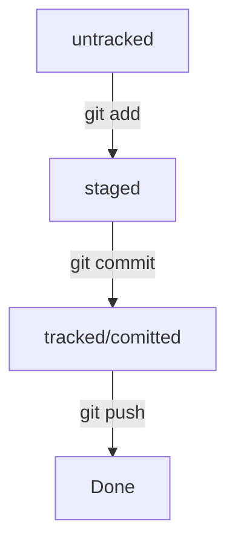

# Git

## Установка Git

Заходим по ссылке [https://git-scm.com/downloads](https://git-scm.com/downloads), скачиваем и устанавливаем версию для своей операционной системы.

После завершения установки, открываем любой терминал. Пользователям Windows рекомендуется использовать оболочку Git Bash, которая будет установлена вместе с Git. Пользователи Linux и macOS могут использовать стандартный терминал встроенный в их операционные системы.

Для проверки того, что Git был успешно установлен в систему, в терминале нужно выполнить следующую команду `git --version` . Если все в порядке, будет выведена установленная версия Git.

## Настройка Git

Установка имени и электронной почты:

`git config --global user.name "Ваше имя"`
`git config --global user.email "Ваша почта"`

Параметры окончаний строк для пользователей Mac/Unix:

`git config --global core.autocrlf input`
`git config --global core.safecrlf true`

Параметры окончаний строк для пользователей Windows.

`git config --global core.autocrlf true`
`git config --global core.safecrlf true`

Из-за флага `--global` настройки применяются глобально в системе, то есть для всех будущих проектов. Поэтому настройка выполняется один раз.

Посмотреть все установленные настройки можно командой:

`git config --list`.

## Команда **`git init`**

Инициализирует git в текущей папке и создает локальный репозиторий. В текущей папке создается подпапка **`.git`** содержащая все служебные файлы составляющие основу репозитория. Любые файлы и папки вложенные в текущую смогут быть подставлены под версионный контроль. Инициализация репозитория выполняется один раз на проект.

## Пара локальный/удаленный

Для создания GitHub-репозитория существуют два основных подхода.

Первый — это инициализация локального репозитория и его привязка к репозиторию на GitHub при помощи команды.
`git remote add origin ссылка_на_репозиторий`

Второй (основной) — это создание репозитория на сервере GitHub и его клонирование к себе на компьютер при помощи команды.
`git clone ссылка_на_репозиторий`

Синхронизация локального и удалённого репозиториев

Команда `git clone` копирует проект на локальный компьютер.

`git clone @` автоматически связывает локальный репозиторий по ссылке `@` с удалённым.

@ `https://github.com/yandex-praktikum/git-clone-lesson` ссылка на репозиторий

@ `git@github.com:yandex-praktikum/git-clone-lesson.git` SSH ссылка на репозиторий.

`git remote add origin https://github.com/YandexPracticum/first-project.git` — привяжет локальный репозиторий к удалённому с URL `https://github.com/YandexPracticum/first-project.git`;

`git remote -v` (от англ. verbose, «подробный») — проверь, что репозитории действительно связались;

`git push -u origin main` (от англ. push, «толкать») — в первый раз загрузи все коммиты из локального репозитория в удалённый с названием `origin`.

💡 Ваша ветка может называться master, а не main. Подправьте команду, если это необходимо.

`git push` (от англ. push, «толкать») — загрузи коммиты в удалённый репозиторий после того, как он был привязан с помощью флага `-u`.

## Команда **`git status`**

Проверяет в каком состоянии находятся файлы проекта и отображает эту информацию в терминале. Каждый файл может находиться в одном из двух состояний: под версионным контролем (отслеживаемые) и нет (неотслеживаемые).

Неотслеживаемые файлы — это любые файлы в рабочем каталоге, которые еще никогда небыли зафиксированы и не входили в коммит.

Отслеживаемые файлы — это те файлы, которые были зафиксированы и входили в коммит. Они могут быть неизменёнными, изменёнными или подготовленными к коммиту.

## Команда **`git add`**

Позволяет проиндексировать и зафиксировать изменения в файлах, тем самым добавив файлы под версионный контроль.

`git add .` зафиксирует все произошедшие изменения.

`git add todo.txt` зафиксирует изменения только в указанном файле `todo.txt`.

`git add имя_папки` зафиксирует изменения во всех файлах в указанной папке.

`git add --all` зафиксирует сразу все файлы, в которых были изменения, и все новые файлы.

## Команда **`git commit`**

Создает коммит, точку сохранения, запись в истории изменений.
В коммит входят все зафиксированные на текущий момент изменения отслеживаемых файлов:
`git commit -m "Мой комментарий к коммиту"`

Если необходимо изменить описание последнего коммита (например исправить ошибку):
`git commit --amend -m "Мой измененный комментарий к последнему коммиту"`

## Команда **`git push`**

Позволяет отправить историю коммитов локального репозитория на связанный с ним удаленный репозиторий, например на GitHub.

Связывает локальный и удаленный репозиторий и отправляет историю коммитов на удаленный репозиторий. Делается один раз на ветку. У тебя пока что только одна ветка master, поэтому команда выполняется один раз на проект:
`git push -u origin master`

Отправляет историю коммитов на ранее привязанный удаленный репозиторий:
`git push`

## Схема команд для Git

## Создаём pull request

**pull request** (англ. «запрос на изменения»; буквально: «запрос на подтягивание»). В обиходе его обычно так и называют — «пул-реквест», или ещё короче — ПР или PR.

Алгоритм:

1. Вы трудитесь над задачей в своей ветке — например, пишете код новой функциональности.

2. Вы заканчиваете работу, а затем создаёте пул-реквест.

3. Ваши коллеги проверяют, что код выглядит аккуратно и лаконично, а программа работает корректно; также оставляют комментарии.
   Этот процесс называют **code review** (англ. «рассмотрение кода»), или просто ревью.

4. После финального согласования вы заливаете свою ветку в основную.

Из чего состоит pull request и чем он может обернуться:

У каждого пул-реквеста есть:

**Название** — краткое описание предлагаемых изменений. Например: Адаптивный заголовок сайта, Замена альбома на галерею и так далее.

**Описание** — развёрнутое описание изменений. Это поле заполнять необязательно, но желательно.

**Исходная ветка** — та, в которой вы работали. Например, feature/merge-request.

**Целевая ветка** — основная ветка проекта, в которую вы хотите внести изменения.

Также у каждого пул-реквеста может быть два исхода:

**merge** (англ. «соединить») — предлагаемые изменения приняты; код вливается в целевую ветку; пул-реквест закрывается.

**close** (англ. «закрыть») — пул-реквест закрывается без слияния изменений.

## Просмотр информации о коммитах

`git log` выведет подробную историю коммитов;

`git log --oneline` покажет краткую информацию о коммитах: сокращённый хеш и сообщение.

## Как исправить коммит **`--amend`**

`--amend` рассчитан на работу с последним коммитом (`HEAD`).
Дополнить коммит новыми файлами можно с помощью `git commit --amend --no-edit`. Благодаря опции `--no-edit` сообщение к коммиту останется таким, каким и было.

Изменить сообщение к коммиту позволяет команда git commit `--amend -m "Обновлённое сообщение коммита"`.

## «Откат» файлов и коммитов

`git restore --staged hello.txt` — переводит файл hello.txt из состояния staged обратно в untracked или modified;

`git restore hello.txt` вернет файл hello.txt к последней версии, которая была сохранена через git commit или git add;

`git reset --hard b576d89` удалит все незакоммиченные изменения из staging и «рабочей зоны» вплоть до указанного коммита.

 
 Как откатиться назад, если «всё сломалось»

https://practicum.yandex.ru/trainer/git-basics/lesson/78d6157b-a248-4c26-a2f8-5b7bdf270bc4/

Вы сделали коммит, после которого «всё сломалось». Какую команду использовать, чтобы «откатить» репозиторий на более ранний коммит?

`git reset --hard <более ранний коммит>`

Вы добавили изменения в staging area и хотите вернуть их в modified. Какую команду выбрать?

`git restore --staged <файл>`

Вы случайно изменили файл, который вообще не хотели менять. Но в staging его пока не добавили. Какую команду нужно выполнить?

`git restore <файл>`

## Команда **`git diff`**. Просмотр изменений

`git diff` — покажет изменения в «рабочей зоне», то есть в `modified`-файлах;

`git diff a9928ab 11bada1` — выведет разницу между двумя коммитами;

`git diff <ветка> <ветка>` — выведет разницу между двумя ветками;

`git diff master~3 master` — выведет разницу между тем коммитом, который был три коммита назад, и текущим;

`~` — отсчет начинается с 0, т.е. `~2` будет 2-ой элемент от текущего (HEAD) в глубь = 3-ий элемент в списке.

`git diff --staged` — покажет изменения, которые добавлены в `staged`-файлах.

## Работа с ветками

`git branch` Показывает список веток и ту в которой мы находимся.

`git branch ИМЯ` Создает новую ветку с наванием ИМЯ.

`git branch -D ИМЯ` Удаляет ветку с названием ИМЯ.

`git checkout ИМЯ` Переходит в ветку с названием ИМЯ.

`git checkout -b ИМЯ` Создает новую ветку с названием ИМЯ и сразу же на нее переключается.

`git push --set-upstream origin ИМЯ-ВЕТКИ` Пушит дочернюю ветку в удаленный репозиторий(это не слияние).

`git merge <имя ветки>` Находясь в главной ветке вызвать git merge и название ветки которую сливаем с главной.

`git pull` Забирает все обновления с удаленного репозитория.

## Игнорирование файлов

Практически всегда есть группа файлов, которые вы не только не хотите автоматически добавлять в репозиторий, но и видеть в списках неотслеживаемых. К таким файлам обычно относятся автоматически генерируемые файлы (различные логи, результаты сборки и т.п.). В таком случае, в корне проекта, можно создать файл **`.gitignore`** с перечислением шаблонов соответствующих таким файлам.

# GitHub

Переходим по ссылке http://github.com/, регистрируем учетную запись с приличным ником на рабочую почту. В процессе регистрации выбираем бесплатный план и пропускаем заполнение опросника.

## Создание SSH-ключа

В терминале выполняем команду `ssh -T -p 443 git@ssh.github.com`, если ответ положительный - можно использовать SSH.

Переходим по ссылке [connecting-to-github-with-ssh](https://docs.github.com/en/authentication/connecting-to-github-with-ssh) и выполняем пошаговую инстукцию. SSH-ключ создается один раз для каждого компьютера с которого будем работать с GitHub.

## Навигация в консоли

`pwd` (от англ. print working directory, «показать рабочую папку») — покажи, в какой я папке;

`ls` (от англ. list directory contents, «отобразить содержимое директории») — покажи файлы и папки в текущей папке;

`ls -a` — покажи также скрытые файлы и папки, названия которых начинаются с символа `.`;

`cd` first-project (от англ. change directory, «сменить директорию») — перейди в папку first-project;

`cd` first-project/html — перейди в папку html, которая находится в папке first-project;

`cd ..` — перейди на уровень выше, в родительскую папку;

`cd ~` — перейди в домашнюю директорию (/Users/Username);

`cd /` — перейди в корневую директорию.
